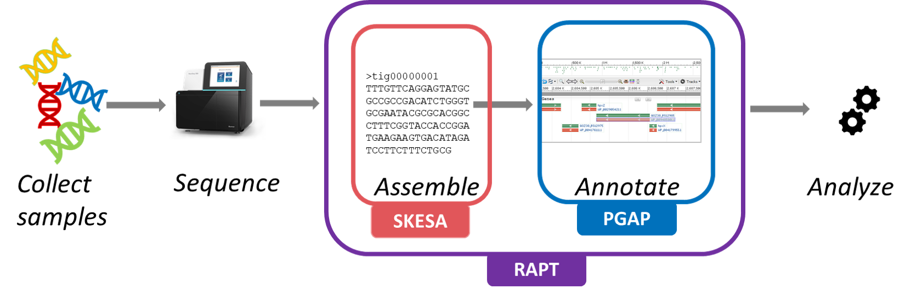

# Read Assembly and Annotation Pipeline Tool (RAPT)

RAPT is a NCBI pipeline designed for assembling and annotating short genomic sequencing reads obtained from bacterial or archaeal isolates. RAPT consists of two major components, [SKESA](https://github.com/ncbi/SKESA) and [PGAP](https://github.com/ncbi/pgap). SKESA is a *de novo* assembler for microbial genomes based on DeBruijn graphs. PGAP is a prokaryotic genome annotation pipeline that combines *ab initio* gene prediction algorithms with homology-based methods. RAPT takes an SRA run or a fasta or fastq file of Illumina reads as input and produces an assembled and annotated genome. 

If you are new to RAPT, please visit our [wiki page](https://github.com/ncbi/rapt/wiki) for detailed information, and watch a [short webinar](https://www.youtube.com/watch?v=7trM1pKAVXQ).



To use the latest version, download the RAPT command-line interface with the following commands:
```
~$ curl -sSLo rapt.tar.gz https://github.com/ncbi/rapt/releases/download/v0.4.0/rapt-v0.4.0.tar.gz
~$ tar -xzf rapt.tar.gz && rm -f rapt.tar.gz
```


There should be two scripts in your directory now, `run_rapt_gcp.sh` and `run_rapt.py`, corresponding to two variations of RAPT:  Google Cloud Platform (GCP) RAPT and Standalone RAPT. [GCP RAPT](https://github.com/ncbi/rapt/wiki/GCP%20RAPT%20In-depth%20Documentation%20and%20Examples) is designed to run on GCP and is for users with GCP accounts (please note this is different from a gmail account), while [Stand-alone RAPT](https://github.com/ncbi/rapt/wiki/Standalone%20RAPT%20In-depth%20Documentation%20and%20Recommendations) can run on any computing environments meeting a few pre-requisites.

For instructions on running RAPT, please go to their respective documentation pages: [GCP RAPT](https://github.com/ncbi/rapt/wiki/GCP%20RAPT%20In-depth%20Documentation%20and%20Examples) or [Stand-alone RAPT](https://github.com/ncbi/rapt/wiki/Standalone%20RAPT%20In-depth%20Documentation%20and%20Recommendations).
