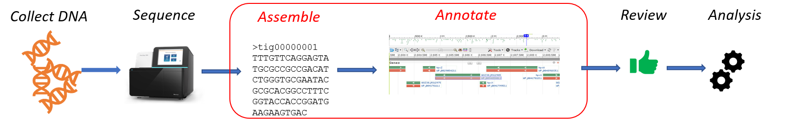

# Read Assembly and Annotation Pipeline Tool (RAPT) – Documentation
RAPT is a NCBI pipeline designed for assembling and annotating Illumina genome sequencing reads obtained from bacterial or archaeal isolates. RAPT consists of two major NCBI components, SKESA and PGAP. SKESA is a de-novo assembler for microbial genomes based on DeBruijn graphs. PGAP is a prokaryotic genome annotation pipeline that combines ab initio gene prediction algorithms with homology based methods. RAPT takes an Illumina SRA run or a fasta file as input and produces an assembled and annotated genome. 

Download latest RAPT: [zipball](https://github.com/ncbi/rapt/releases/download/v0.2.0/rapt-v0.2.0.zip) or [tarbal](https://github.com/ncbi/rapt/releases/download/v0.2.0/rapt-v0.2.0.tar.gz)

There are two variations of RAPT;  Google Cloud Platform (GCP) RAPT and Standalone RAPT.

[GCP RAPT](GCP%20RAPT.md) is designed to run on GCP and is for users with GCP accounts, please note this is different from a gmail account.

[Standalone RAPT](Standalone%20RAPT.md) is for download and execution on computing environments meeting a few pre-requisites.

For instructions on running RAPT, please go to their respective documentation pages: [GCP RAPT](GCP%20RAPT.md), [Standalone RAPT](Standalone%20RAPT.md).  
