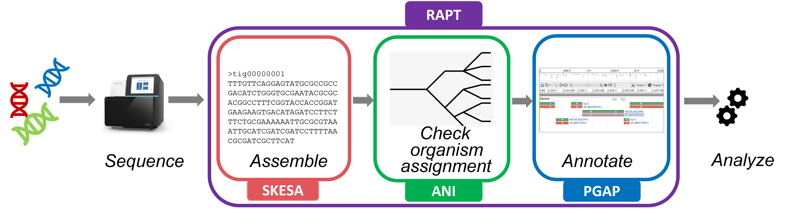

# Read Assembly and Annotation Pipeline Tool (RAPT)

RAPT is an NCBI pipeline designed for **assembling and annotating short genomic sequencing reads** obtained from **bacterial or archaeal isolates** *de novo*. It takes an SRA run or a fasta or fastq file of Illumina reads as input and produces an assembled and annotated genome of **quality comparable to RefSeq** in a couple of hours. 
RAPT consists of three major components, the genome assembler [SKESA](https://github.com/ncbi/SKESA), the taxonomic assignment tool [ANI](https://pubmed.ncbi.nlm.nih.gov/29792589/) and the Prokaryotic Genome Annotation Pipeline ([PGAP](https://github.com/ncbi/pgap)).

With RAPT you will:  <br>
* **assemble your reads** into contigs<br>
* **assign a scientific name** to the assembly<br>
* **predict coding and non-coding genes** *de novo*, including anti-microbial resistance (AMR) genes and virulence factors, based on expert-curated data such as hidden Markov models and conserved domain architectures<br>
* **estimate the completeness and contamination level** of the annotated assembly<br>

If you are new to RAPT, please visit our [wiki page](https://github.com/ncbi/rapt/wiki) for detailed information, and watch a [short webinar](https://www.youtube.com/watch?v=7trM1pKAVXQ).



To use the latest version, download the RAPT command-line interface with the following commands:
```
~$ curl -sSLo rapt.tar.gz https://github.com/ncbi/rapt/releases/download/v0.5.5/rapt-v0.5.5.tar.gz
~$ tar -xzf rapt.tar.gz && rm -f rapt.tar.gz
```


There should be two scripts in your directory now, `run_rapt_gcp.sh` and `run_rapt.py`, corresponding to two variations of RAPT:  Google Cloud Platform (GCP) RAPT and Standalone RAPT. [GCP RAPT](https://github.com/ncbi/rapt/wiki/GCP_RAPT_doc) is designed to run on GCP and is for users with GCP accounts (please note this is different from a gmail account), while [Stand-alone RAPT](https://github.com/ncbi/rapt/wiki/Standalone_RAPT_doc) can run on any computing environments meeting a few pre-requisites.

For instructions on running RAPT, please go to their respective documentation pages: [GCP RAPT](https://github.com/ncbi/rapt/wiki/GCP_RAPT_doc) or [Stand-alone RAPT](https://github.com/ncbi/rapt/wiki/Standalone_RAPT_doc).
