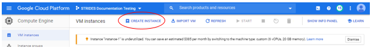

### Can I use reads that are not produced by an Illumina sequencing machine?

At this time RAPT only supports FASTQ files from Illumina and SRR files from SRA.

### Can I assemble and annotate a metagenomic sample?
No, RAPT is only designed to work on data from singe strains.

### I do not wish to run SKESA. Can I use a different read assembler?

At this time, RAPT only supports [SKESA](https://www.ncbi.nlm.nih.gov/pubmed/30286803). If you wish to annotate an already assembled genome, please use [PGAP](https://github.com/ncbi/pgap)

### Who do I contact for help or feedback?

Please send questions or comments to:  [prokaryote-tools@nih.gov](prokaryote-tools@nih.gov)
I THINK WE SHOULD ENCOURAGE USERS TO OPEN GITHUB ISSUE FIRST. NO?

### What environments are supported with RAPT?

RAPT is only supported on the Google Cloud Platform.

### What information is reported to NCBI?

For each run of the pipeline, multiple reports will be generated. One at the beginning, and one at the end of each phase of RAPT. These reports help us measure our impact on the community, which in turns helps us get funds, so please report your usage. For more information see the [NCBI privacy policy](https://www.ncbi.nlm.nih.gov/home/about/policies.shtml).  We collect will look like this:

        1 34.86.175.158 8bd35abb-8a04-4984-9d88-59c349824819 2020-07-10T12:24:44 rapt_start 
        1 34.86.175.158 8bd35abb-8a04-4984-9d88-59c349824819 2020-07-10T12:25:55 skesa_success
        1 34.86.175.158 8bd35abb-8a04-4984-9d88-59c349824819 2020-07-10T12:54:22 ani_start 
        1 34.86.175.158 8bd35abb-8a04-4984-9d88-59c349824819 2020-07-10T13:24:88 ani_success
        1 34.86.175.158 8bd35abb-8a04-4984-9d88-59c349824819 2020-07-10T13:25:44 pgap_start
        1 34.86.175.158 8bd35abb-8a04-4984-9d88-59c349824819 2020-07-10T19:46:11 pgap_success
        1 34.86.175.158 8bd35abb-8a04-4984-9d88-59c349824819 2020-07-10T19:46:11 rapt_exit

### How do I turn of the NCBI reporting feature?

Although we recomend always reporting information back to NCBI because this helps us build a better product by understanding usage and errors, you can disable this by adding the following to your submitjob command.

'--no-usage-report' 

### How do I run on a GCP instance or virtual machine?

Follow the set-up instruction for running in a Cloud Shell. 
 
- On the GCP screen from the last step, click &quot;Compute Engine&quot; or navigate to the &quot;Compute Engine&quot; section by clicking on the navigation menu with the &quot;hamburger icon&quot; (three horizontal lines) on the top left corner.  

 ]
- Click on the blue &quot;CREATE INSTANCE&quot; button on the top bar.  

 

- Create an image with the default parameters. Give your instance a name for tracking and enable access to all Cloud APIs. Plus look at the expense for record keeping.

- Click the blue &quot;Create&quot; button. This will create and start the VM.  

  
 
SSH into your instance.

### I have further questions about PGAP?

See the [PGAP FAQs](https://github.com/ncbi/pgap/wiki/FAQ)
