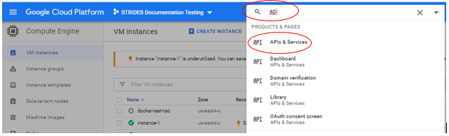
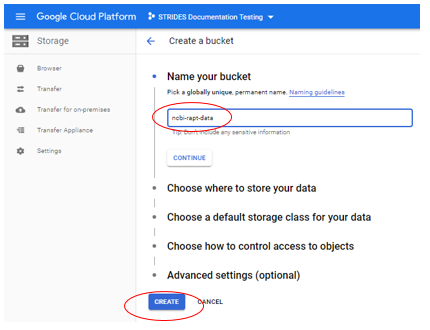
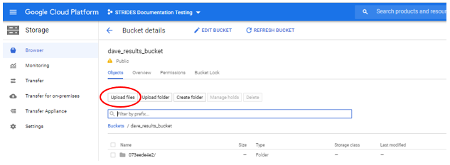

# In-depth Documentation and Examples

This wiki contains step by step examples of installing and running the RAPT command line application on the Google Cloud Platform (GCP).  Some basic knowledge of Unix/Linux commands, [NCBI-SKESA](https://github.com/ncbi/SKESA), and [NCBI-PGAP](https://github.com/ncbi/pgap) is useful in completing this tutorial.

## Table of Contents

   * [System Requirements](#system-requirements)    
   * [Quick Start using a Cloud Shell](#quick-start-using-a-cloud-shell)   
   * [Using fastq files as input for Running RAPT](#using-fastq-files-as-input-for-running-rapt)  


# System Requirements

RAPT is designed to run on the Google Cloud Platform (GCP), it will run from the Google Shell or from a google instance with the following prerequisites:

- gcloud SDK (automatically enabled in Cloud Shell)
- gsutil tool (automatically enabled in Cloud Shell)
- Cloud Life Sciences 
- Access to a GCP bucket for your data

RAPT will bring up and shut down Google instances as needed.

# Quick start using a Cloud Shell

1. In a browser, sign into [GCP](https://console.cloud.google.com/) with your google username and password
2. [Enable Cloud Life Sciences API](https://cloud.google.com/life-sciences/docs/quickstart) (This may already be enabled for your account)
  - Follow these steps to Enable
  - Type api in Search product and resources box and select APIs &amp; Services



- Select ENABLE APIS AND SERVICES


- Type cloud life in search box and select Google Cloud Life Sciences API


- Choose Enable, use all defaults. You are now finished with this operation.

3. Create GCP bucket:
- Type bucket in Search product and resources box and select Create bucket 

 

- Name your bucket and select CREATE  
Note: Please write down the name of your bucket, because the name will be needed to be supplied during execution. Also, we recommend putting your initials in the name is case it will be shared with others.  
Note: By choosing Create, you bucket is personal, if you want it to share by others, you can make modifications after it is created.  
Note: If you use someone else&#39;s bucket, you need write permission.  
 

- You are now finished with this operation.
4. Go back to Compute Engine – hint, you can put compute engine into Search product and resources box

5. Start a [Cloud Shell](https://ssh.cloud.google.com/cloudshell/editor) by pressing its icon. A Cloud Shell has certain [limits](https://cloud.google.com/shell/docs/limitations), if you find these limits to restricting, go to the section on using a [Google Cloud Platform Virtual Machine](#Set-up-RAPT-on-Google-Cloud-Platform-Virtual-Machine).


**You are now ready to install and run RAPT**   

Cut and paste or type in the following commands at the command line prompt
```bash
gsutil cp -r gs://ncbi-rapt/bin .
cd bin
chmod 755 ./run_rapt_gcp.sh
```

**Run Rapt** 

Running with help will provide you instructions and options for running.
```bash
./run_rapt_gcp.sh help
```

**Help output example**

```bash
$ ./run_rapt_gcp.sh help
GCP Account: [1111111111111-compute@example.gserviceaccount.com]
Project: [example]
usage: run_rapt_gcp.sh  <command>  [options]
    commands:
    submitjob [options]         Run RAPT application on GCP
        [-r SRR]                SRA Run Accession
        [-f FASTQ]              URI to a fastq file in Google Storage Bucket
        [-b|--bucket URI]       Google Storage Bucket uri for storing output files
        [--organism]            genus species, required by [-f]
        [--strain]              strain, optional
        [--label LABEL]         user-specified label, optional
        [--skesa_only]          Run SKESA only, optional
        [--no-usage-reporting]  send no usage information to NCBI, optional
        [--machine-type TYPE]   set the machine type of the VM instance, optional, default n1-standard-8
        [--boot-disk-size NUM]  set the boot disk size, optional, default 128
    joblist [options]           List jobs in table format
        [-n|--limit NUM]        show only the latest NUM jobs
        [--csv]                 list jobs in csv format
    jobdetails <job-id>         Check the status of a job id
    cancel <job-id>             Cancel a running job
    help                        Print out the usage
    test [options]              Run functional tests
        [-b|--bucket URI]       Google Storage Bucket uri
        [--label LABEL]         user-specified label
        [--skesa_only]          Run SKESA only
    version                     Print out the version of RAPT
```


**To run RAPT, you need:**
- Identify the SRA run(s) or Illumina sequenced reads for the genome you wish to assemble and annotate. These can be in a fasta file in a Google bucket, or they can be in a run in SRA.  
Important: Only reads sequenced on Illumina machines can be used by RAPT. 

To demonstrate how to run RAPT, we are going to use SRR3496277, a set of reads available in SRA for *Mycoplasma pirum*.  

This example takes about 1 hour and 50 minutes.

Run the following command where gs://your_results_bucket is your GCP bucket for RAPT output and logging data 
```bash
./run_rapt_gcp.sh submitjob -r SRR3496277 --bucket gs://your_results_bucket
```

Execution information
```bash
$ ./run_rapt_gcp.sh submitjob -r SRR3496277 --bucket gs://your_results_bucket 
GCP Account: [1111111111111-compute@example.gserviceaccount.com]
Project: [example]
job id: [2565f37562]
job output: [gs://your_results_bucket/2565f37562]
Job is now running on GCP, and may take several hours
View the execution logs in https://console.cloud.google.com/logs/viewer?project=example&filters=text:2565f37562
Use joblist or jobdetails command to check the completion status
```

Please note that some runs may take up to 24 hours  


**Review the output** 

RAPT generates three files and puts them in the GCP bucket you specified. The starting 10 characters, "2894b72f9f" are from the job id assigned to your RAPT run.
1. `2894b72f9f.log` is file with the log of scripts and variables of your RAPT run 
2. `2894b72f9f.verbose.log` is a detailed log file of all the actions that RAPT performed for your run 
3. `2894b72f9f.out` is a tar-gzipped directory of the following output files

Assembled contigs in FASTA format: ERR3272653.skesa.fa  :multifasta files of the assembled contigs produced by SKESA
Taxonomy verification results: ani-tax-report.txt and ani-tax-report.xml
PGAP annotation results in multiple formats 

• `annot.gbk`: annotated genome in GenBank flat file format  
• `annot.gff`: annotated genome in GFF3 format  
• `annot.sqn`: annotated genome in ASN format  
• `annot.faa`: multifasta file of the proteins annotated on the genome  
• `annot.fna`: multifasta file of the trancripts annotated on the genome  
 
See a [detailed description of the annotation output files](https://github.com/ncbi/pgap/wiki/Output-Files) for more information. 

**Notes:**

- RAPT is unable to submit jobs if GCloud configuration provides a default region. Please create a new Google Cloud configuration without specifying a default region to run this script.
- Google Storage Bucket URI - Required for each run. The user needs to provide a Google Storage Bucket uri for storing the logging and output file. One can provide the bucket uri by specifying --bucket argument when submit job or run test case. Or one can provide the bucket uri by setting BUCKET environment variable.
  ```bash
  ./run_rapt_gcp.sh --bucket gs://your-bucket/path ...
  ```
  or:
  ```bash
  export BUCKET="gs://your-bucket/path"
  ./run_rapt_gcp.sh command ...
  ```
- The joblist command shows a list of jobs with headers as follow: job_id,user,user_label,srr,done,status,start_time,end_time, output_uri. Only done: YES and status: OK represents a successfully completed job.

**run_rapt_gcp.sh usage examples:**  

**submitjob**
- Submit a job, then exit:
```bash
./run_rapt_gcp.sh submitjob -r SRR4835119 --bucket gs://your-bucket .
```
- Submit a job with a user-defined label:
```bash
./run_rapt_gcp.sh submitjob -r SRR4835119 --bucket gs://your-bucket --label label-test-1
```

**jobdetails**
- Check the details of a job:
```bash
./run_rapt_gcp.sh jobdetails job-id
```

**joblist**
- List jobs in table format:
```bash
./run_rapt_gcp.sh joblist; List jobs in table format.
```
- List the latest jobs in csv format:
```bash
./run_rapt_gcp.sh joblist -n; N List the latest jobs in csv format.
```
- List the latest N jobs in tabular format:
```bash
./run_rapt_gcp.sh joblist --n; N --csv
```

**cancel**
- Cancel a running job:
```bash
./run_rapt_gcp.sh cancel job-id
```
**test**
- Run test cases without waiting the for the test to complete:
```bash
./run_rapt_gcp.sh test --bucket gs://your-bucket
```

Now it is your turn to try. Select your SRR and run. Try using some of the options. 

Keep in mind that the RAPT process can take several hours. 

Exit the Cloud Shell when you are done.   


## Using fastq files as input for Running RAPT

RAPT supports Illumina SRA run(s) or fastq files as input.  You will need to copy these files to a Google bucket or to your VM instance. There are mutiple ways of doing this:

1. Upload to a GCP bucket
Select upload from GCP bucket screen  
 

2. Using gcloud commands

To copy the file *$HOME/SRR3496277_frag.mapped.fastq* to the home directory of GCP instance-1 
Instance name can be found in your Google Cloud Console -> Compute Engine -> VM instances
```bash
gcloud compute scp $HOME/SRR3496277_frag.mapped.fastq instance-1:~
```

3. Upload function from your Cloud Shell.  

 

To Run RAPT with a use the -f option and point to the location of the fastq file and use the -b option to point to your Google bucket for output

Here is an example of using a file in a Google bucket.
```bash
./run_rapt_gcp.sh submitjob -f gs://ncbi-rapt-scratch2/SRR3496277_frag.mapped.fastq -b gs://ncbi-rapt-scratch2 --label wl_fastq_frag_test --organism "Mycoplasma pirum" --strain "ATCC 25960"
```
Please note that the quotes are required for the orgasim and stain options.

Here is an example of using a file in your instance.
```bash
./run_rapt_gcp.sh submitjob -f ./SRR3496277_frag.mapped.fastq -b gs://ncbi-rapt-scratch2 --label wl_fastq_frag_test --organism "Mycoplasma pirum" --strain "ATCC 25960"
```


