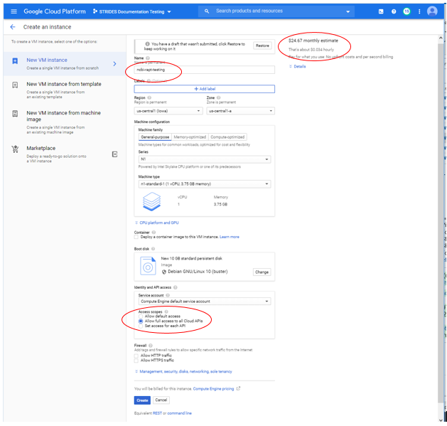

### Can I use reads that are not produced by an Illumina sequencing machine?
At this time RAPT only supports reads produced on the Illumina sequencing platform. Reads can be provided to RAPT as fasta or fastq files or as SRA run accessions (starting with the SRR, DRR or SRR prefix).

### Can I assemble and annotate a metagenomic sample?
No. RAPT is only designed to work on data sequenced from bacterial or archaeal isolates. 

### I do not wish to run SKESA. Can I use a different read assembler?
At this time, RAPT only supports [SKESA](https://www.ncbi.nlm.nih.gov/pubmed/30286803). If you wish to annotate an already assembled genome, please use [PGAP](https://github.com/ncbi/pgap).

### What environments are supported with RAPT?
At the moment, RAPT is only supported on the Google Cloud Platform.

### What information is reported to NCBI?
For each run of the pipeline, multiple reports will be generated. One at the beginning, and one at the end of each phase of RAPT. These reports help us measure our impact on the community, which in turns helps us get funds, so please report your usage. For more information see the [NCBI privacy policy](https://www.ncbi.nlm.nih.gov/home/about/policies.shtml).  We collect will look like this:

        1 34.86.175.158 8bd35abb-8a04-4984-9d88-59c349824819 2020-07-10T12:24:44 rapt_start 
        1 34.86.175.158 8bd35abb-8a04-4984-9d88-59c349824819 2020-07-10T12:25:55 skesa_success
        1 34.86.175.158 8bd35abb-8a04-4984-9d88-59c349824819 2020-07-10T12:54:22 ani_start 
        1 34.86.175.158 8bd35abb-8a04-4984-9d88-59c349824819 2020-07-10T13:24:88 ani_success
        1 34.86.175.158 8bd35abb-8a04-4984-9d88-59c349824819 2020-07-10T13:25:44 pgap_start
        1 34.86.175.158 8bd35abb-8a04-4984-9d88-59c349824819 2020-07-10T19:46:11 pgap_success
        1 34.86.175.158 8bd35abb-8a04-4984-9d88-59c349824819 2020-07-10T19:46:11 rapt_exit

### How do I turn off the NCBI reporting feature?
Although we recomend always reporting information back to NCBI because this helps us build a better product by understanding usage and errors, you can disable this by adding the following ```--no-usage-report``` to the ```run_rapt_gcp.sh``` job submission command.

### The taxonomy check step indicates that the organism for my input data is misassigned. What does it mean, and what should I do?
The [taxonomy check](https://www.ncbi.nlm.nih.gov/pmc/articles/PMC6978984/) compares the set of contigs assembled by RAPT to type strain assemblies available in GenBank. A misassignment indicates that the short read sequences passed to RAPT on input come from a different organism than the one provided. 
 - If you have provided a fasta or fastq file with a genus species on input, and if the genus calculated by taxonomy check is different, re-run RAPT with the genus and species suggested by the taxonomy check process. This will guarantee the best annotation quality possible. If the genus is the same but the species is different, there is nothing to do. The annotation produced by RAPT is correct.
- If you have provided an SRA run on input, please identify another run that fits your needs. Alternatively, you can download the run from SRA and provide the resulting fasta as input to RAPT (```submitfastq``` parameter) with the corrected genus species.   

### The run is marked "Finished", but the results tar.gz file in the storage bucket is empty
One possible reason is failure to connect to SRA. Such failures are reported in the log file ```<job-id>.log```, with the line ```SRA connection check failed with code 1, abort..```, and are typically transient. Please retry.

### What is the default options for --machine-type TYPE, --boot-disk-size NUM, and --timeout SECONDS, why would I change them?

    --machine-type TYPE
      Default is "n1-highmem-32" (refer to google cloud documentation), which is suitable for most jobs.  The larger the machine, the faster the job will be. 
      There is a point of diminishing returns which will vary per user and their cost/time preferences.

    --boot-disk-size NUM
      Optional. Set the size (in Gb) of boot disk for the virtual machine. Default size is 128.  The larger the boot disk, the faster the job will be. 
      There is a point of diminishing returns which will vary per user and their cost/time preferences.

    --timeout SECONDS
      Optional. Set the timeout (seconds) for the job. Default is 86400s (24 hours). If you have a job that does not complete in this time, 
      you can increase the timeout and/or increase your machine type.
      
      
### Can I run RAPT on smaller machines and save money?
Yes, you can. By default, RAPT runs on n1-highmem-32 machines, but you can choose a different type of machines with the parameter ```--machine-type```. RAPT will run on machines as small as n1-standard-8, but the run time will be affected. We have observed that the run time with 16 CPU is nearly half of what it is with 8 CPU, so there is no cost advantage in running on an 8-CPU machine, based on the [current Google virtual machine cost structure](https://cloud.google.com/compute/vm-instance-pricing). There are some genomes for which PGAP steps require higher memory, so we recommend using highmem machines. In short, if n1-highmem-32 machines are cost-prohibitive, we recommend you use n1-highmem-16 machines. If some failures are tolerable, n1-standard-16 machines can also be considered. 

### Can RAPT run faster?
By default, RAPT runs on n1-highmem-32 machines. The performance gain by switching to a larger machine (using the parameter ```--machine-type```), such as n1-highmem-64 is likely to be less than 30%. Beware that it would likely increase the [cost of the run](https://cloud.google.com/compute/vm-instance-pricing).

### How do I run on a GCP instance or virtual machine?
Follow the set-up instruction for running in a Cloud Shell. 
 
- On the GCP screen from the last step, click &quot;Compute Engine&quot; or navigate to the &quot;Compute Engine&quot; section by clicking on the navigation menu with the &quot;hamburger icon&quot; (three horizontal lines) on the top left corner.  

 ]
- Click on the blue &quot;CREATE INSTANCE&quot; button on the top bar.  

 


- Create an image with the default parameters. Give your instance a name for tracking and enable access to all Cloud APIs. Plus look at the expense for record keeping.

- Click the blue &quot;Create&quot; button. This will create and start the VM.  

  
 
SSH into your instance.


### I have further questions about PGAP. Where can I find more information?
See the [PGAP FAQs](https://github.com/ncbi/pgap/wiki/FAQ)

### Who do I contact for help or feedback?
Please open an review [issue](https://github.com/ncbi/rapt/issues), after checking that your question was not addressed in previously opened issues.
