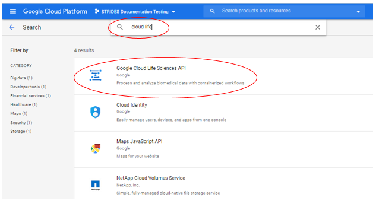
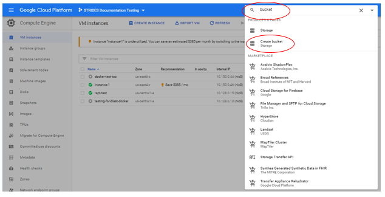
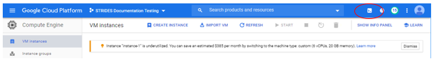
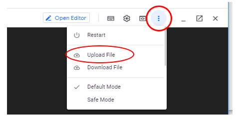

# In-depth Documentation and Examples

This wiki contains step by step examples of installing and running the RAPT command line application on the Google Cloud Platform (GCP).  Some basic knowledge of Unix/Linux commands, [NCBI-SKESA](https://github.com/ncbi/SKESA), and [NCBI-PGAP](https://github.com/ncbi/pgap) is useful in completing this tutorial.

## Table of Contents

   * [System Requirements](#system-requirements)    
   * [Quick Start using a Cloud Shell](#quick-start-using-a-cloud-shell)   
   * [Using fastq files as input for Running RAPT](#using-fastq-files-as-input-for-running-rapt)  


# System Requirements

RAPT is designed to run on the Google Cloud Platform (GCP), it will run from the Google Shell or from a google instance with the following prerequisites:

- gcloud SDK (automatically enabled in Cloud Shell)
- gsutil tool (automatically enabled in Cloud Shell)
- Cloud Life Sciences 
- Access to a GCP bucket for your data

RAPT will bring up and shut down Google instances as needed.

# Quick start using a Cloud Shell

1. In a browser, sign into [GCP](https://console.cloud.google.com/) with your google username and password
2. [Enable Cloud Life Sciences API](https://cloud.google.com/life-sciences/docs/quickstart) (This may already be enabled for your account)
  - Follow these steps to Enable
  - Type api in Search product and resources box and select APIs &amp; Services


- Select ENABLE APIS AND SERVICES


- Type cloud life in search box and select Google Cloud Life Sciences API



- Choose Enable, use all defaults. You are now finished with this operation.

3. Create GCP bucket:
- Type bucket in Search product and resources box and select Create bucket 

 

- Name your bucket and select CREATE  
Note: Please write down the name of your bucket, because the name will be needed to be supplied during execution. Also, we recommend putting your initials in the name is case it will be shared with others.  
Note: By choosing Create, you bucket is personal, if you want it to share by others, you can make modifications after it is created.  
Note: If you use someone else&#39;s bucket, you need write permission.  
 

- You are now finished with this operation.
4. Go back to Compute Engine – hint, you can put compute engine into Search product and resources box

5. Start a [Cloud Shell](https://ssh.cloud.google.com/cloudshell/editor) by pressing its icon. A Cloud Shell has certain [limits](https://cloud.google.com/shell/docs/limitations), if you find these limits to restricting you can create a Virtual Machine. When creating the Virtual Machine, make sure you select the option to "Allow full access to all Cloud APIs".



**You are now ready to install and run RAPT**   

Cut and paste or type in the following commands at the command line prompt
```bash
curl -o run_rapt_gcp.sh https://raw.githubusercontent.com/ncbi/rapt/master/dist/run_rapt_gcp.sh
chmod 755 ./run_rapt_gcp.sh
```

**Run Rapt** 

Running with help will provide you instructions and options for running.
```bash
./run_rapt_gcp.sh help
```

**Help output example**

```bash
$ ./run_rapt_gcp.sh help
Usage: run_rapt_gcp.sh  <command>  [options]

Job creation commands:

        submitacc <sra_acxn> <-b|--bucket URL> [--label LABEL]
                [--skesa-only] [--no-usage-reporting] [--machine-type TYPE] [--boot-disk-size NUM]
                [--timeout SECONDS]

                Submit a job to run RAPT on an SRA run accession (sra_acxn).

        submitfastq <fastq_uri> <--organism "Genus species"> [--strain "ATCC xxxx"]
                <-b|--bucket URL> [--label LABEL] [--skesa-only]
                [--no-usage-reporting] [--machine-type TYPE] [--boot-disk-size NUM]
                [--timeout SECONDS]

                Submit a job to run on sequences in a custom FASTQ formatted file.
                fastq_uri is expected to point to location in google cloud storage (bucket).

                The --organism argument is mandatory, but can contain only the genus part. Species
                part is recommended but optional. The --strain argument is optional.
                All taxonomy information provided here will appear in output data.

        test <-b|--bucket> [--label LABEL] [--skesa-only]
                [--no-usage-reporting]

                Run the internal test suites. When RAPT does not produce the expected results,
                it may be helpful to use this command run the test suite to ensure RAPT
                is functioning normally.

                Common options:
                ======================
                -b|--bucket URL

                        Mandatory. Specify the destination storage location to store results and job logs.

                --label LABEL

                        Optional. Tag the job with a custom label, which can be used to filter jobs
                        with the joblist command. Google cloud platform requires that the label
                        can only contain lower case letters, numbers and dash (-). Dot and white spaces
                        are not allowed.

                --skesa-only

                        Only assemble sequences to contigs, but do not annotate.

                --no-usage-reporting

                        Optional. Prevents usage report back to NCBI. By default, RAPT sends usage
                        information back to NCBI for statistical analysis. The information collected
                        are a unique identifier for the RAPT process, the machine IP address, the 
                        start and end time of RAPT, and its three modules: SKESA, taxcheck and PGAP. 
                        No personal or project-specific information (such as the input data) are collected.
                        
                   --regions
                        Optional, comma-separated. Specify in which GCP region(s) RAPT should run.
	                    Note: it should be regions in which you have sufficient CPU quotas (verify
	                    at https://console.cloud.google.com/iam-admin/quotas/details). Default is
		                a single region, us-east4.        

                --machine-type TYPE

                        Optional. Specify the type of google cloud virtual machine to run this job
	                    (see Google documentation, https://cloud.google.com/compute/docs/machine-types).
	                    Default is "n1-highmem-16", which is suitable for most jobs.

                --boot-disk-size NUM

                        Optional. Set the size (in Gb) of boot disk for the virtual machine. Default
                        size is 128.

                --timeout SECONDS

                        Optional. Set the timeout (seconds) for the job. Default is 86400s
                        (24 hours).

Job control commands:

        joblist [-n|--limit NUM] [--csv]
                [-d|--delimiter DELIM]

                List jobs under current project. Jobs are are sorted by their submission time,
                latest first. Use -n or --limit to limit the number of jobs to display.
                Specify --csv will list jobs in comma-delimited table instead of
                tab-delimited. Specify a delimit character using "-d|--delimiter DELIM"
                will override --csv and output a custom delimited table.


        jobdetails <job-id>

                All job creating commands, if successful, will display a job-id that uniquely
                identify the job created. This command can be used to display the detailed
                information of the job identified by the job-id. Be aware this is mostly about
                technical details of how the job is created and handled by google cloud platform,
                mostly useful to developers and technical staff than to general users.

        cancel <job-id>

                Cancel a running job

        version

                Display the current RAPT version.

        help

                Display this usage page.
```


**To run RAPT, you need:**
- Identify the SRA run(s) or Illumina sequenced reads for the genome you wish to assemble and annotate. These can be in a fasta file in a Google bucket, or they can be in a run in SRA.  
Important: Only reads sequenced on Illumina machines can be used by RAPT. 

To demonstrate how to run RAPT, we are going to use SRR3496277, a set of reads available in SRA for *Mycoplasma pirum*.  

This example takes about 1 hour.

Run the following command where [gs://your_results_bucket](https://cloud.google.com/storage/docs/creating-buckets) is your GCP bucket for RAPT output and logging data 
```bash
./run_rapt_gcp.sh submitacc SRR3496277 --bucket gs://your_results_bucket  
```

Execution information
```bash
$ ./run_rapt_gcp.sh submitacc SRR3496277 --bucket gs://your_results_bucket

RAPT job has been created successfully.
----------------------------------------------------
Job-id:             5541b09bb9
Output storage:     gs://your_results_bucket/5541b09bb9
GCP account:        1111111111111-compute@developer.gserviceaccount.com
GCP project:        example
----------------------------------------------------

[**Attention**] RAPT jobs may take hours to finish. Progress of this job can be viewed in GCP stackdriver log viewer at:

        https://console.cloud.google.com/logs/viewer?project=strides-documentation-testing&filters=text:5541b09bb9

For current status of this job, run:

        run_rapt_gcp.sh joblist | fgrep 5541b09bb9

For technical details of this job, run:

        run_rapt_gcp.sh jobdetails 5541b09bb9
$ 
```

Please note that some runs may take up to 24 hours  


**Review the output** 

RAPT generates three output files and puts them in the GCP bucket you specified. These files are named after the 10-character job-id assigned at the start of the execution (i.e. "2894b72f9f"). 
1. 2894b72f9f.log is file with the log of scripts and variables of your RAPT run   
2. 2894b72f9f.verbose.log is a detailed log file of all the actions that RAPT performed for your run   
3. 2894b72f9f_output.tar.gz is a tar-gzipped directory of the following output files:   
    a. skesa.out.fa: multifasta files of the assembled contigs produced by SKESA   
    b. ani-tax-report.txt and ani-tax-report.xml: Taxonomy verification results in text or XML format   
    c. PGAP annotation results in multiple formats:   
        * annot.gbk: annotated genome in GenBank flat file format     
        * annot.gff: annotated genome in GFF3 format     
        * annot.sqn: annotated genome in ASN format     
        * annot.faa: multifasta file of the proteins annotated on the genome   
        * annot.fna: multifasta file of the trancripts annotated on the genome   
        * calls.tab: tab-delimited file of the coordinates of detected foreign sequence. Empty if no foreign contaminant was found.
 
See a [detailed description of the annotation output files](https://github.com/ncbi/pgap/wiki/Output-Files) for more information. 

**Notes:**

- RAPT is unable to submit jobs if GCloud configuration provides a default region. Please create a new Google Cloud configuration without specifying a default region to run this script.
- Google Storage Bucket URI - Required for each run. The user needs to provide a Google Storage Bucket uri for storing the logging and output file. One can provide the bucket uri by specifying --bucket argument when submit job or run test case. Or one can provide the bucket uri by setting BUCKET environment variable.
  ```bash
  ./run_rapt_gcp.sh --bucket gs://your-bucket/path ...
  ```
  or:
  ```bash
  export BUCKET="gs://your-bucket/path"
  ./run_rapt_gcp.sh command ...
  ```
- The joblist command shows a list of jobs with headers as follow: job_id,user,user_label,srr,done,status,start_time,end_time, output_uri. Only done: YES and status: OK represents a successfully completed job.

**run_rapt_gcp.sh usage examples:**   

**submitfastq**
- Submit a job, then exit:
```bash
./run_rapt_gcp.sh submitacc SRR4835119 --bucket gs://your-bucket .
```
- Submit a job with a user-defined label:
```bash
./run_rapt_gcp.sh submitacc SRR4835119 --bucket gs://your-bucket --label label-test-1
```

**jobdetails**
- Check the details of a job:
```bash
./run_rapt_gcp.sh jobdetails job-id
```

**joblist**
- List jobs in table format:
```bash
./run_rapt_gcp.sh joblist; List jobs in table format.
```
- List the latest jobs in csv format:
```bash
./run_rapt_gcp.sh joblist -n; N List the latest jobs in csv format.
```
- List the latest N jobs in tabular format:
```bash
./run_rapt_gcp.sh joblist -n N --csv
```

**cancel**
- Cancel a running job:
```bash
./run_rapt_gcp.sh cancel job-id
```
**test**
- Run test cases without waiting the for the test to complete:
```bash
./run_rapt_gcp.sh test --bucket gs://your-bucket
```

Now it is your turn to try. Select your SRR and run. Try using some of the options. 

Keep in mind that the RAPT process can take several hours. 

Exit the Cloud Shell when you are done.   

## Using fastq files as input for Running RAPT

You can use a fastq or a fasta file produced by Illumina sequencers as input to RAPT. This file can contain paired-end reads, with the two reads of a pair adjacent to each other in the file or single-end reads. Note that the quality scores are not necessary. The genus species of the sequenced organism needs to be provided on the command line. The strain is optional.  The file needs to be copied to a Google storage bucket or to the Google Cloud shell from which you run ```run_rapt_gcp.sh```.  There are mutiple ways of doing this:

1. Upload to a GCP bucket
Select upload from GCP bucket screen  
 

2. Using gcloud commands

To copy the file *$HOME/SRR3496277_frag.mapped.fastq* to the home directory of GCP instance-1 
Instance name can be found in your Google Cloud Console -> Compute Engine -> VM instances
```bash
gcloud compute scp $HOME/SRR3496277_frag.mapped.fastq instance-1:~
```

3. Upload function from your Cloud Shell.  

 

To Run RAPT with a fastq file, use the submitfastq command, point to the location of the fastq file, and use the -b option to point to your Google bucket for the output location.

Here is an example of using a file in a Google bucket.
```bash
./run_rapt_gcp.sh submitfastq gs://ncbi-rapt-scratch2/SRR3496277_frag.mapped.fastq -b gs://ncbi-rapt-scratch2 --label wl_fastq_frag_test --organism "Mycoplasma pirum" --strain "ATCC 25960"
```

Please note that the quotes are required for the organism and strain options.

Here is an example of using a file in your instance.
```bash
./run_rapt_gcp.sh submitfastq ./SRR3496277_frag.mapped.fastq -b gs://ncbi-rapt-scratch2 --label wl_fastq_frag_test --organism "Mycoplasma pirum" --strain "ATCC 25960"
```


